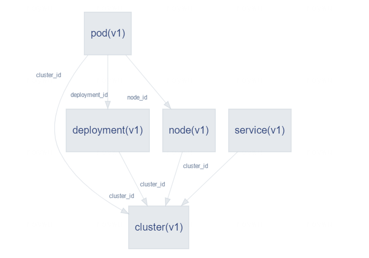

# Kubernetes插件

## 简介

Kubernetes插件基于Kubernetes(简称k8s)集群，围绕模型注册，应用部署，多k8s集群，事件监听等能力，提供更统一的管理入口，更实时的部署/监控管理。

插件主要分为2个模块：

API Server：提供模型查询接口，部署插件接口

Watcher：提供持续的事件监听，触发wecube编排

模型注册：提供Cluster/Node/Deployment/POD/Service 实时数据模型查询

应用部署：支持无状态的应用部署管理，支持私有化镜像，以及LB配置

多k8s集群：支持多套K8s集群管理，应用部署更统一

事件监听：根据场景自定义编排任务快速响应，自动化处理

## 痛点解决

在云原生趋势下，应用更趋向于无状态化，容器化，K8s作为云原生的重要载体，其特性带来的好处同时，也给运维带来了更多挑战：

  a) 多k8s集群时如何快速获取相关信息？故障时如何快速得知我的应用当前容器所在，以便快速定位问题？

​       Kubernetes插件结合WeCube平台能力，提供了模型查询能力，基于统一的配置表达式，实时获取资源信息

​       eg. kubernetes:cluster{name eq 'cluster-dev01'}~(cluster_id)kubernetes:node  获取cluster-dev01的计算节点列表

​       eg. wecmdb:deploy_unit{name eq 'myapp'}~(correlation_id)kubernetes:deployment~(deployment_id)kubernetes:pod.node_id>kubernetes:node  获取myapp对应的pod所在主机列表

  

  b) 如何应对容器应用监控？

​      使用WeCube编排能力，可以快速计算 应用->部署单元->Deployment-​>POD->计算节点 关系链，结合WeCMDB应用设计信息，快速配置初始容器/日志监控

​      当K8s集群自动调度，容器发生变动？响应pod.added和pod.deleted编排事件，即可快速更新监控视图，保持最新状态。

## 反馈

如果您遇到问题，请给我们提[Issue](https://github.com/WeBankPartners/wecube-plugins-kubernetes/issues/new/choose)，我们会第一时间反馈。